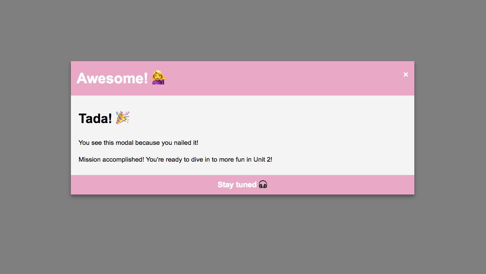

# Lesson 11. はじめてのJavaScriptアプリケーション

```
所要時間: 45分
ステータス: ドラフト
タイプ: プロジェクト
```

## 目的

- JavaScriptの基本的な構造、構文を役割とともに理解し、簡単なアプリケーションを作れるようになる。

## プロジェクトの取り組み方

1. マイルストーンごとに要件に合うようにファイルを編集していきます。
2. 分からない部分があれば、今までのレッスンを復習して、再度チャレンジしてみましょう。
3. 再チャレンジしてしばらく考えても分からない場合はチャットでメンターに質問しましょう。
4. 完成したら、Dropboxでメンターとファイルを共有して下さい。
5. メンターから課題レビューが届きます。
6. ビデオチャットの際は、分からない点を更に突っ込んで聞いたり、より良い書き方を聞いてみましょう。

## 概要

JavaScriptでこれまで学んできたDOMやイベント、関数、if文、演算子を全て使い、クリックで開いたり閉じたりするポップアップ モーダルアプリケーションを作成しましょう。

## 完成見本

- クリック前 & モーダル外クリック後


- クリック後



## スターターファイル

自分のパソコン上に、project11というフォルダを作って、その中に`index.html`、`styles.css`、`main.js`というファイルをそれぞれ作成しましょう。それぞれのファイルには以下のスターターファイルの内容をコピーして下さい。

[codegrit-js-unit01-ch11-starter](https://github.com/codegrit-jp-students/codegrit-js-unit01-ch11-starter)

## マイルストーン１

### 要件

- DOM、イベント、関数、if文、演算子を全て使用します。
- イベントにはクリックを使用しましょう。
- クリックでモーダルを開く、バツ印をクリックでモーダルが閉じる、モーダルの外のどこでも良いのでクリックすると開いていたモーダルが閉じる、という3つの関数を作成しましょう。

## 評価

課題の後、以下の２つについてメンターにフィードバックをお願いします。

1. 要件のカバー度: 1.全く出来なかった 2.ほとんど出来なかった 3. 半分ほどは出来た 4.8割ほどは出来た 5. 全部出来た
2. 難易度: 1. とても難しかった 2. 難しかった 3. ちょうど良かった 4. 簡単だった 5. とても簡単だった
